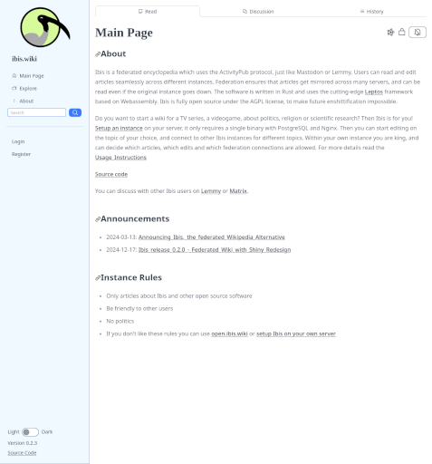
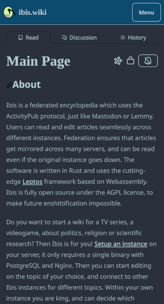

[](https://woodpecker.join-lemmy.org/Nutomic/ibis)
[](LICENSE)

About Ibis
===


Ibis is a federated encyclopedia which uses the ActivityPub protocol, just like Mastodon or Lemmy.  Users can create, browse, edit articles and use [many other features](https://github.com/Nutomic/ibis?tab=readme-ov-file#features). If you want to start a wiki for a TV series, a videogame, or an open source project then Ibis is for you! You can register on an [existing instance](https://ibis.wiki/explore) or [install it on your own server](https://ibis.wiki/article/Setup_Instructions). Then you can start editing on the topic of your choice, and connect to other Ibis instances for different topics. Federation ensures that articles get mirrored across many servers, and can be read even if the original instance goes down. Ibis is fully open source to make future enshittification impossible.

| Desktop (Light Theme) | Mobile (Dark Theme) |
|-|-|
|  |  |

Contributions are more than welcome, especially for the frontend.

## Features

- Fully functional wiki with article creation, reading, editing and edit history
- Conflict handling in case of concurrent edits
- Articles have discussion page with nested comments
- Fully federated, all actions work locally as well as with remote Ibis instances
- Simple installation, only a single binary or Docker image with Postgres database
- Snappy editor with live preview and markdown support
- Various markdown extensions like LaTeX, table of contents, footnotes, spoilers
- Dark mode, so that you can write articles from the beach or from your basement
- Explore page to discover interesting articles
- Fast user interface with server-side rendering based on Webassembly
- Notification system to get notified about new articles, edits and comments
- In the future Ibis will be fully federated with Mastodon, Lemmy and other Fediverse platforms


## Useful links

- [Usage Instructions](https://ibis.wiki/article/Usage_Instructions)
- [Setup Instructions](https://ibis.wiki/article/Setup_Instructions)

## Community

Discuss with other Ibis users on Matrix or Lemmy:

- [Matrix](https://matrix.to/#/#ibis:matrix.org)
- [Lemmy](https://lemmy.ml/c/ibis)

## Name

The Ibis is a [bird which is related to the Egyptian god of knowledge and science](https://en.wikipedia.org/wiki/African_sacred_ibis#In_myth_and_legend).

## Development

First install PostgreSQL and setup the development database:
```sh
psql -c "CREATE USER ibis WITH PASSWORD 'ibis' SUPERUSER;" -U postgres
psql -c "CREATE DATABASE ibis WITH OWNER ibis;" -U postgres
```

You need to install [cargo](https://rustup.rs/), [pnpm](https://pnpm.io/) and [cargo-leptos](https://github.com/leptos-rs/cargo-leptos). Use `pnpm install` to get Javascript dependencies. You need to enable the wasm target for Rust using `rustup target add wasm32-unknown-unknown`. Then run `cargo leptos watch` which automatically rebuilds the project after changes. Open the site at [localhost:3000](http://localhost:3000/). You can login with user `ibis` and password `ibis`.

The IP and port where the server serves the content can be changed with the env var `LEPTOS_SITE_ADDR`. Defaults to `127.0.0.1:3000`.

## Donate

Developing a project like this takes a significant amount of work. You can help funding it with donations:

- [Liberapay](https://liberapay.com/Ibis/)
- Bitcoin: `bc1q6mqlqc84q2h55jkkjvex4kc6h9h534rj87rv2l`
- Monero: `84xnACZv82UNTEGNkttLTH8sCeV9Cdr8dHMJSNP6V2hEJW7C17S9xQTUCghwG8TePrRD9wfiPRWcwYvSTHUNoyJ4AXnQYLD`

## License

[AGPL](LICENSE)
